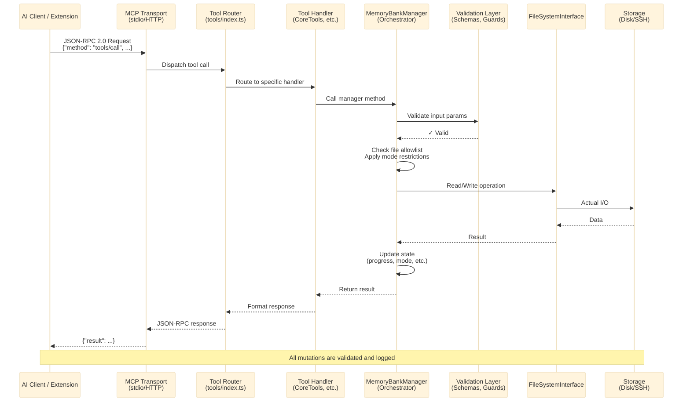

# Architecture

High-level overview of the Memory Bank MCP server codebase.

## Layer Diagram

```
┌──────────────────────────────────────────────────┐
│                   MCP Protocol                   │
│            (JSON-RPC over stdio/SSE)             │
├──────────────────────────────────────────────────┤
│                MemoryBankServer                  │
│          src/server/MemoryBankServer.ts          │
├────────────┬────────────┬────────────────────────┤
│   Tools    │ Resources  │       Prompts          │
│  (write)   │  (read)    │                        │
├────────────┴────────────┴────────────────────────┤
│              MemoryBankManager                   │
│             src/core/MemoryBankManager.ts        │
├──────────┬──────────┬──────────┬─────────────────┤
│  Graph   │ Progress │  Mode    │ Store Registry  │
│  Store   │ Tracker  │ Manager  │                 │
├──────────┴──────────┴──────────┴─────────────────┤
│            FileSystem Abstraction                │
│  LocalFileSystem │ RemoteFileSystem (SSH)        │
│         CachingFileSystem (decorator)            │
└──────────────────────────────────────────────────┘
```

---

## Architecture Diagrams

### Request Flow — Tool Invocation Path

Shows the complete path of a tool request from client to storage.



## Source Layout

```
src/
├── index.ts                    # Entry point — parses CLI args, starts server
├── server/
│   ├── MemoryBankServer.ts     # MCP server setup and routing
│   ├── tools/                  # MCP tool handlers (one file per domain)
│   │   ├── index.ts            # Tool registration and dispatch
│   │   ├── CoreTools.ts        # init, read, write, status, search
│   │   ├── ContextTools.ts     # get_context_digest, get_context_bundle
│   │   ├── DecisionTools.ts    # log_decision
│   │   ├── GraphTools.ts       # Knowledge graph CRUD
│   │   ├── ModeTools.ts        # switch_mode, get_current_mode, UMB
│   │   ├── ProgressTools.ts    # track_progress, add_progress_entry
│   │   └── StoreTools.ts       # Multi-store management
│   └── resources/
│       ├── index.ts
│       └── MemoryBankResources.ts  # MCP resource endpoints
├── core/
│   ├── MemoryBankManager.ts    # Central orchestrator (init, read, write, mode)
│   ├── ProgressTracker.ts      # Structured progress entries
│   ├── StoreRegistry.ts        # Multi-store path management
│   ├── graph/
│   │   ├── GraphStore.ts       # Append-only event log + snapshot
│   │   ├── GraphIds.ts         # Branded ID generation
│   │   ├── GraphReducer.ts     # JSONL → snapshot replay
│   │   ├── GraphRenderer.ts    # Snapshot → Markdown
│   │   ├── GraphSchemas.ts     # Input validation
│   │   └── GraphSearch.ts      # Entity lookup
│   └── templates/
│       ├── CoreTemplates.ts    # Default markdown file content
│       └── index.ts
├── types/
│   ├── index.ts                # Re-exports
│   ├── graph.ts                # Graph types, branded IDs, event union
│   ├── rules.ts                # Clinerules interfaces
│   ├── progress.ts             # Progress entry types
│   ├── guards.ts               # Runtime type guards
│   ├── constants.ts            # Core file list, tool names
│   └── memory-bank-constants.ts
└── utils/
    ├── FileUtils.ts            # File I/O helpers
    ├── LogManager.ts           # Structured logging
    ├── ModeManager.ts          # Mode state machine
    ├── ExternalRulesLoader.ts  # .mcprules-* file loading
    ├── McpRulesTemplates.ts    # Default rules for each mode
    ├── MigrationUtils.ts       # Version migration helpers
    ├── ETagUtils.ts            # Content hashing for caching
    ├── SshUtils.ts             # SSH connection helpers
    └── storage/
        ├── FileSystemInterface.ts  # Abstract FS contract
        ├── LocalFileSystem.ts      # Node fs implementation
        ├── RemoteFileSystem.ts     # SSH/SFTP implementation
        ├── CachingFileSystem.ts    # Read-cache decorator
        └── FileSystemFactory.ts    # Factory for FS selection
```

## Key Concepts

### Memory Bank Files
The server manages a set of markdown files in a `memory-bank/` directory:

| File | Purpose |
|------|---------|
| `product-context.md` | Project overview, goals, tech stack |
| `active-context.md` | Current tasks, blockers, next steps |
| `progress.md` | Chronological progress log |
| `decision-log.md` | Decisions with rationale |
| `system-patterns.md` | Architecture patterns |

### Knowledge Graph
An append-only JSONL event log (`graph/graph.jsonl`) that materializes into a snapshot (`graph.snapshot.json`). Operations:
- **upsert_entity** / **delete_entity**
- **add_observation** / **delete_observation**
- **link_entities** / **unlink_entities**

Write operations are serialized via an async write queue to prevent race conditions.

### Modes
Five operational modes (`architect`, `ask`, `code`, `debug`, `test`) configured via `.mcprules-{mode}` files. Each mode has:
- Custom instructions
- File authority rules (read/write/create permissions)
- Tool usage guidelines
- UMB (Update Memory Bank) triggers

Modes are auto-created from templates if missing during initialization.

### Storage Abstraction
All file I/O goes through `FileSystemInterface`, enabling:
- **Local** — direct Node.js `fs` calls
- **Remote** — SSH/SFTP via `ssh2`
- **Caching** — decorator that caches reads with ETag invalidation

### Multi-Store
`StoreRegistry` allows managing multiple memory banks from a single server instance. Each store has an ID, path, and optional label.

## Data Flow

```
AI Client → MCP Protocol → MemoryBankServer
  → Tool dispatch (tools/index.ts)
    → Tool handler (e.g., CoreTools.handleWriteMemoryBankFile)
      → MemoryBankManager (orchestration + validation)
        → FileSystem (LocalFileSystem | RemoteFileSystem)
          → Disk / SSH
```

## VS Code Extension
The companion extension lives in `vscode-extension/` and provides:
- Tree views for memory bank files and modes
- Commands for initialization, mode switching
- MCP client that communicates with the server via stdio
- Copilot integration (instructions, chat participant)
