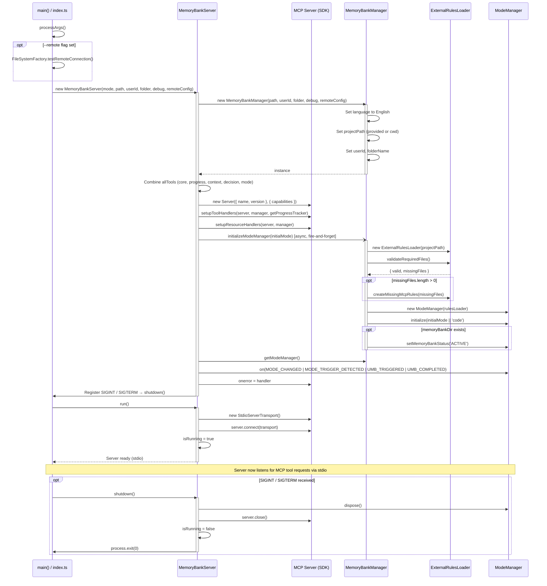

# Memory Bank MCP Startup Process Documentation

This document describes the startup process of the Memory Bank MCP server, detailing each step from command execution until the server is ready to receive requests.

## Startup Command

Memory Bank MCP is started through the `memory-bank-mcp` command, which is configured as a binary in `package.json`:

```json
"bin": {
  "memory-bank-mcp": "build/index.js"
}
```

## Command Line Options

The command accepts the following options:

| Option      | Short form | Description                                     |
| ----------- | ---------- | ----------------------------------------------- |
| `--mode`    | `-m`       | Set execution mode (code, ask, architect, etc.) |
| `--path`    | `-p`       | Set project path (default: current directory)   |
| `--folder`  | `-f`       | Set Memory Bank folder name (default: memory-bank) |
| `--username`| `-u`       | Set username for progress tracking (can be name or GitHub URL) |
| `--debug`   | `-d`       | Enable debug mode (show detailed logs)          |
| `--help`    | `-h`       | Display program help                            |

## Step-by-Step Startup Process

### 1. Program Entry (`index.ts`)

1. The script starts with the shebang `#!/usr/bin/env node` to allow direct execution.
2. The `processArgs()` function parses command line arguments.
3. The `main()` function is called to start the server.

### 2. Server Creation (`main()`)

1. Processes command line arguments.
2. Displays informative messages about the options used.
3. Creates a new instance of `MemoryBankServer` with the provided options.
4. Calls the `run()` method to start the server.
5. Sets up handlers for unhandled promise rejections.

### 3. Server Initialization (`MemoryBankServer.constructor()`)

1. Creates an instance of `MemoryBankManager` with the provided options.
2. Combines all available tools (core, progress, context, decision, mode).
3. Creates an instance of the MCP server with the combined tools.
4. Sets up tool and resource handlers.
5. Initializes the mode manager with the initial mode.
6. Sets up listeners for mode manager events.
7. Sets up the server error handler.
8. Sets up handlers for process termination signals (SIGINT, SIGTERM).

### 4. Server Execution (`MemoryBankServer.run()`)

1. Checks if the server is already running.
2. Creates a stdio server transport.
3. Connects the server to the transport.
4. Sets the `isRunning` flag to true.
5. Displays information about the current mode and Memory Bank status.

### 5. Memory Bank Manager Initialization

During the creation of `MemoryBankManager`:

1. Sets the language to English.
2. Configures the project path (provided or current directory).
3. Configures the GitHub profile URL (provided or "Unknown User").
4. Configures the Memory Bank folder name (provided or "memory-bank").
5. Checks for the existence of a memory-bank directory in the project path.

### 6. Mode Manager Configuration

During mode manager initialization:

1. Loads external rules for each mode (architect, ask, code, debug, test).
2. Sets the initial mode (provided or "code").
3. Sets up listeners for mode change events.

## Communication Flow

After initialization, the server:

1. Listens for requests through the stdio transport.
2. Receives MCP tool commands.
3. Forwards commands to the appropriate handlers.
4. Returns results to the client.

## Server Shutdown

The server can be shut down by:

1. Receiving a SIGINT or SIGTERM signal.
2. Calling the `shutdown()` method.

During shutdown:

1. Releases mode manager resources.
2. Closes the MCP server.
3. Sets the `isRunning` flag to false.
4. Terminates the process.

## Sequence Diagram



## Important Considerations

1. The server uses the MCP (Model Context Protocol) for communication.
2. The Memory Bank is always initialized in English, regardless of the system configuration.
3. The server supports different operation modes (code, ask, architect, debug, test).
4. The server can automatically detect triggers for mode changes.
5. The server supports the UMB (Update Memory Bank) mode for updating the Memory Bank.
